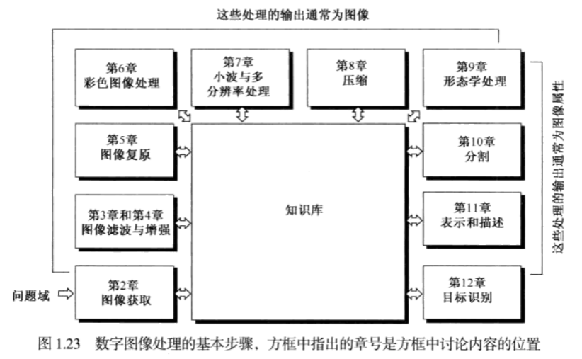
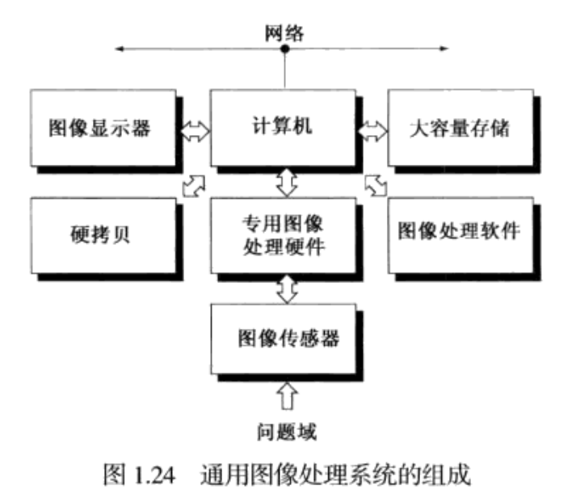

# 数字图像处理1-绪论

### 1.1 什么是数字图像处理
- 一副图像可以定义为一个二维函数f(x,y)，其中x和y是空间(平面)坐标，而在任何一对空间坐标(x,y)处的幅值f称为图像在该点的强度或灰度。当(x,y)和灰度值f是有限的离散数值时，我们称该图像为数字图像。数字图像处理时借助于数字计算机来处理数字图像。注意，数字图像是由有限数量的元素组成的，每个元素都有一个特定的位置和幅值。这些元素称为画图元素，图像元素或像素。像素是广泛用于表示数字图像元素的术语。
### 1.4 数字图像处理的基本步骤
- 图像处理大概可以划分为两类，一类是其输入和输出都是图像；另一类是其输入可能是图像但输出是从这些图像中提取的属性。这种组织结构总结如下图。该图并不是意味着每种处理都用于图像，相反，目的是给出所有方法一个概念，这些方法可以针对不同的目的，不同的目标运用于图像。

  

- 图像获取是图1.23中的第一步处理，这部分将在后续第二章详细介绍，通常图像的处理包括图像预处理，譬如图像缩放等。

- 图像增强是对一副图像进行某种操作，使其结果在某种特定应用中比原始图像更适合处理。注意特定一词，图像增强是建立在面向问题的基础上的。

- 图像复原也是改进图像外观的一个重要领域，然而与图像增强不同，增强技术是主观的，而图像复原技术是客观的。在某种意义上，复原技术倾向于以图像退化的数学或概率模型为基础。另一方面，增强以什么是好的增强效果这种人的主观偏爱为基础。

- 彩色图像处理已经成为一个重要领域，在后续第六章会详细介绍。

- 小波是以不同分辨率来描述图像的基础。特别是。本书中为图像数据压缩和金字塔表示使用了小波，在这里，图像被成功的细分为较小的区域。

- 压缩是指减少图像存储量或降低图像传输带宽的处理。

- 形态学处理涉及提取图像分量的工具，这些分量在表示和描述形状方面很有用。这一章的内容将从输出图像处理到输出图像属性处理的转换开始。

- 分割过程将一副图像划分为它的组成部分或目标，通常，自动分割是数字图像处理中最困难的任务之一。

- 表示与描述几乎总是在分割阶段的输出之后，通常这一输出是未加工的像素数据，这些数据不是构成一个区域的边界，就是构成该区域本身的所有点。无论哪种情况，把数据转化成计算机处理的形式都是必要的。选择一种表示解决把原始数据转化成合适计算机进行后续处理的形式的一部分。描述又称特征选择，涉及提取特征，它可得到某些感兴趣的定量信息，或是区分一组目标与其他目标的基础。

- 识别是基于目标的描述，给该目标赋予标志的过程。
### 1.5 图像处理系统的组成
- 图1.24显示了用于数字图像处理的一个典型通用系统的组成。下面几段讨论每个组件的功能，先从图像感知开始。

  

- 关于感知，需要两个部件来获取数字图像，第一个部件是物理设备，该设备对我们希望成像的目标辐射的能量很敏感。第二个部件是数字化器，数字化器是一种把物理感知装置的输出转化为数字形式的设备。例如在数字视频摄像机中，传感器产生一个与光强成正比的输出，数字化器把该输出转化为数字数据。

- 专用图像处理硬件通常由刚刚谈到的数字化器和执行其他原始操作的硬件[如算术逻辑单元(ALU)]组成，算术逻辑单元对整个图像并行执行算术与逻辑运算。一个简单使用ALU的例子是与数字化一样块的图像取平均操作，这一操作的目的是降低图片噪声。

- 图像处理系统中的计算机是通用计算机，其范围从PC到超级计算机。

- 图像处理软件由执行特定任务的专用模块组成。

- 大容量存储能力在图像处理应用中是必需的。图像处理应用的数字存储分为三个主要的类别：(1)处理期间的短期存储。(2)关系到快速调用的在线存储。(3)档案存储，其特点是不频繁访问。
  - 提供短期存储的一种方法是使用计算机内存。另一种方法是采用专门的存储板，这种存储板称为帧缓存，它们可以存储一帧或多帧图像并快速访问，通常以视频速度(30帧/s)进行访问。
  - 后一种方法实质上允许瞬时缩放，滚动(垂直移动)和摇动(水平移动)图像。帧缓冲器通常放在专用图像处理硬件单元中。
