# 数字图像基础
### 2.2 光和电磁波谱
- 如图2.10所示，我们感受到的可见光的彩色范围只占电磁波的一小部分。
  
  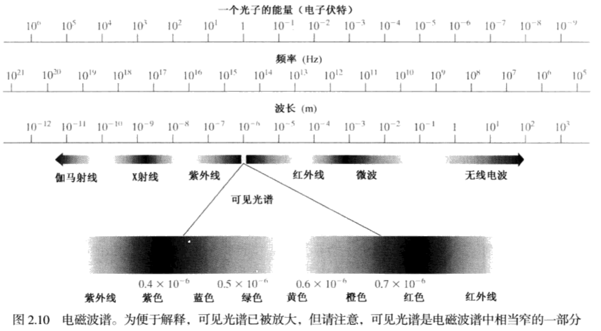电磁波谱可用波长、频率或能量来描述。波长($\lambda$)和频率($v$)的关系可用下式描述。
  
  - $\lambda=\frac{c}{v}$，其中c是光速($2.998×10^8m/s$)。
  
- 电磁波谱的各个分量的能量由下式给出
  - $E=hv$，其中h是普朗克常数。波长的单位是米(m)，最常用的单位是微米($\mu m,1\mu m=10^{-6}m$)和纳米(表示为($nm,1nm=10^{-9}m$)。频率用赫兹(Hz)来度量，1Hz表示正弦波每秒1个周期。常用的能量单位是电子伏特。
  
- 电磁波可以看作是以波长为$\lambda$传播的正弦波(见图2.11)，或者可以看成没有质量的粒子流，每个粒子以波的模式以光速传播和移动。每个无质量的粒子包含一定的(一束)能量，每束能量称为一个光子。
  
  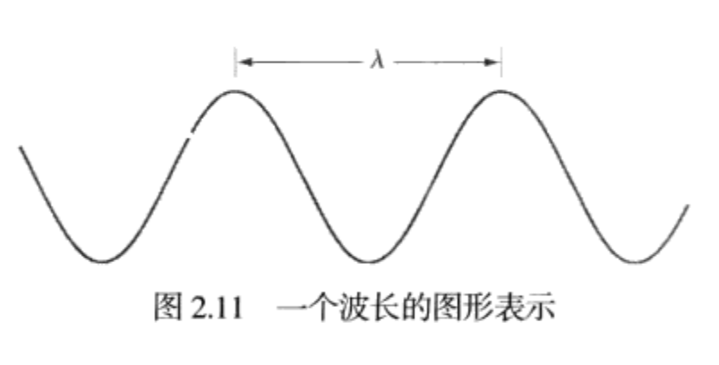
  
- 没有颜色的光称为单色光或无色光，单色光的唯一属性是它的强度或大小。因为感知单色光的强度从黑色到灰色变化，最后到白色，灰度级一词通常用来表示单色光的强度。从黑到白的单色光的度量值范围通常称为灰度级，而单色图像称为灰度图像。
### 2.3 图像的感知和获取
- 我们感兴趣的多数图像都是由”照射“源和形成图像的”场景“元素对光能的反射或吸收而产生的。

- 图2.12显示了用于将照射能量变化为数字图像的三种主要传感器配置。原理很简单：通过将输入电能和对特殊类型检测能源敏感的传感器材料相组合，把输入能源转变为电压。输出电压波形是传感器的响应，通过把传感器响应数字化，从每一个传感器得到一个数字量。

  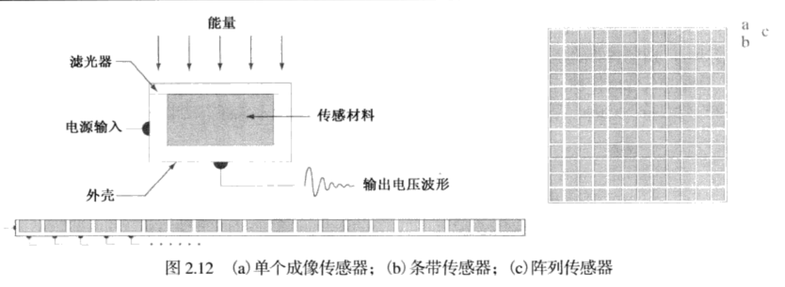
#### 2.3.1 使用单个传感器获取图像
- 图2.12(a)显示了单个传感器的部件，最熟悉的这类传感器也许是发光二极管，它由硅材料构成，并且其输出电压波形与入射光成正比。在传感器前面用一个滤光器改善选择性。例如，传感器前面的绿色(通过)滤光器有利于彩色谱的绿波段光通过。因此，传感器输出的绿光比可见光谱中的其他分量要强。

- 为了使用单一传感器产生二维图像，在传感器和成像区域之间必须有x和y方向的相对位移。图2.13示出了一个用于高精度扫描的装置，其中底片安装在一个鼓上，鼓的机械转动提供了一个维度的位移。单个传感器安装引导螺杆上，它提供与转动相垂直的方向上的移动。因为机械运动可以高精度地控制，所以这一方法是得到高分辨率图像的一种廉价方法(但速度较慢)。
  
  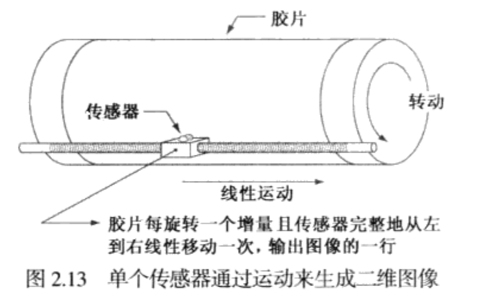
#### 2.3.2 使用条带传感器获得图像
- 比单个传感器更常用的几何结构是内嵌传感器形式的传感器带，如图2.12(b)所示，该传感器带在一个方向上提供成像单元。垂直于传感器带的运动在另一个方向上成像。如图2.14(a)所示，这是大多数平板扫描仪中使用的排列方式。
  
  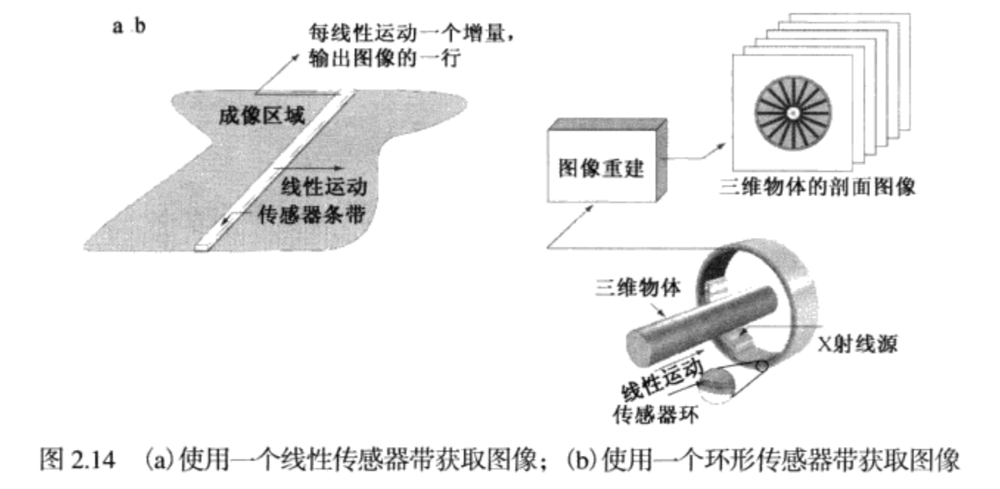
  
- 以圆环形方式安装的传感器带用于医学和工业成像，以得到三维物体的剖面("切片")图像，如图2.14(b)所示。一个旋转的X射线源提供照射，射线源对面的传感器则收集穿过物体的X射线能量(这些传感器必须对X射线敏感)。注意，传感器的输出必须由重建算法处理，重建算法的目的是把感知数据转化成有意义的剖面图像。
#### 2.3.3 使用传感器阵列获取图像
- 图2.12(c)显示了以二维阵列形式排列的单独的传感器，大量的电磁波和一些超声波传感装置常以阵列形式排列。这也是我们在数字摄像机中所看到的主要排列方式。这些摄像机的典型传感器是CCD阵列。这样的传感器阵列所用的主要方式于图2.15。该图显示了来自照射源的能量是场景元素的反射。图2.15(c)所示成像系统执行的第一个功能是收集入射能量，并将它聚焦到一个图像平面上。如果照射的是光，则成像系统的前端是一个光学透镜，该透镜把观察到的场景投影到透镜的聚焦平面上，如图2.15(d)所示，与焦平面重合的传感器阵列产生与每个传感器接收到的光的总量成正比的输出。数字或模拟电路扫描这些输出，并把它们转化为模拟信号，然后由成像系统的其他部分数字化。输出是一副数字图像。

  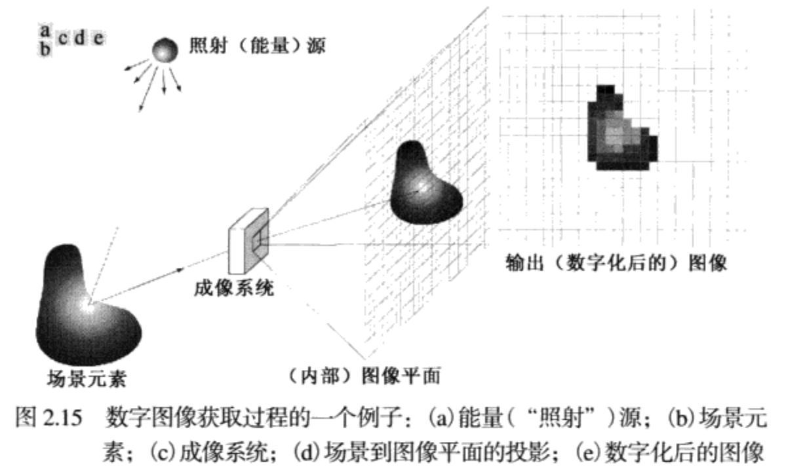
#### 2.3.4 简单的图形学形成模型
- 我们用f(x,y)的二维函数来表示图像，f来表示幅值。函数f(x,y)可由两个分量来表征：(1)入射到被观察场景的光源照射总量。 (2)场景中物体所反射的光照总量。这两个分量分别称为入射分量和反射分量。且分别表示为i(x,y)和r(x,y)。两个函数作为一个积成合并形成f(x,y)。即
  - $$f(x,y)=i(x,y)r(x,y)$$
  其中,  
   - $$0 < i(x,y) < \infty$$
  和  
   - $$0 < f(x,y) < 1$$
### 2.4 图像取样和量化
- 多数传感器的输出是连续的电压波形，这些波形的幅度和空间特性都与感知的物理现象有关，为了产生一幅数字图像，我们需要把连续的感知数据转化为数字形式。这种转化包括两种处理，取样和量化。

- 图2.16 说明了取样和量化的基本概念。图2.16(a)显示了一幅连续图像f，我们想把它转换为数字形式。一幅图像的x和y坐标及幅度可能都是连续的。为将它转化为数字形式，必须在坐标上和幅度上都进行取样操作。对坐标值进行数字化称为取样，对幅值数字化称为量化。
  
  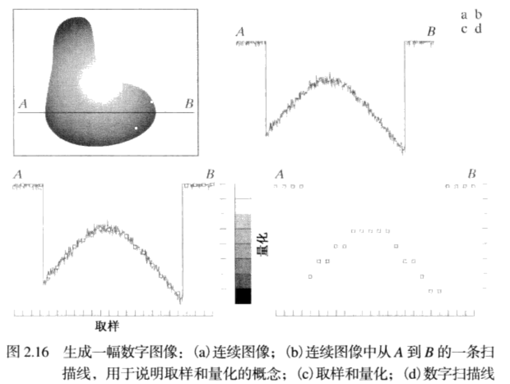
  
- 图2.16(b)中的一维函数是图2.16(a)中沿线段AB的连续图像幅度值(灰度级)的曲线。随机变化是由图像噪声引起的。为了对该函数取样，我们沿线段AB等间隔地对该函数取样，如图2.16(c)所示。每个样本的空间位置由图像底部的垂直刻度指出。样本用放在函数曲线上的白色小方块表示。这样的一组离散位置就给出了取样函数。然而，样本值仍(垂直)跨越了灰度值的连续范围，为了形成数字函数，灰度值也必须转化(量化)离散量。图2.16(c)的右侧显示了已分为8个离散区间的灰度标尺，范围从黑到白。垂至刻度标记指出了8个灰度的每一个特定值。通过对每一样本赋予8个离散灰度级中的一个来量化连续灰度级。赋值取决于该样本与一个垂直刻度标记的垂直接近程度。

- 当传感阵列用于图像获取时，没有运动且阵列中传感器的数量决定了两个方向上的取样限制。传感器输出的量化和前述相同，图2.17说明了这个概念。
  
  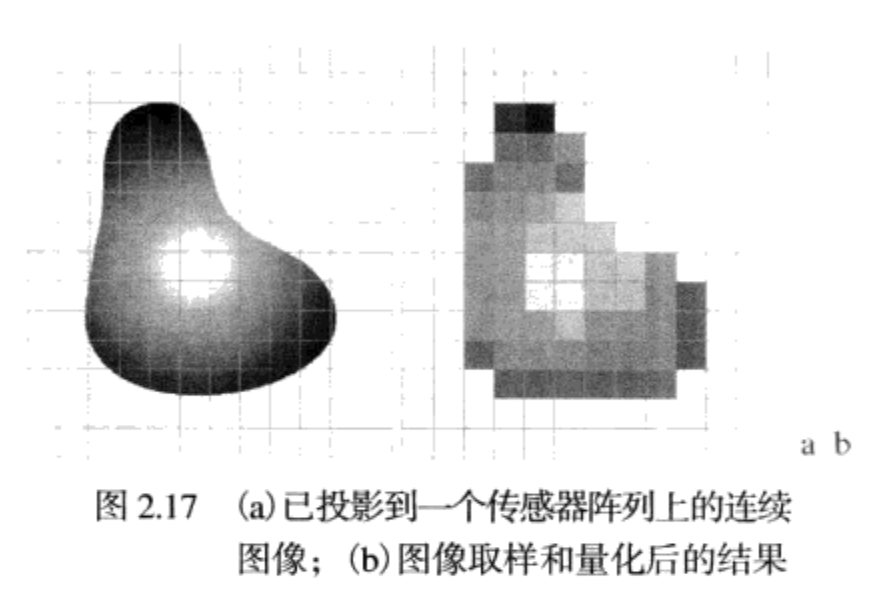
  
- 图2.17(a)显示了投影到一个阵列传感器平面上的连续图像。图2.17(b)显示了取样和量化后的图像。很明显，数字图像的质量在很大程度上取决于取样和量化中所用的样本数和灰度级。
#### 2.4.2 数字图像表示
- 通常，图像在任何坐标(x,y)处的值记为f(x,y)，其中x和y都是整数，由一幅图像的坐标张成的实平面部分称为空间域，x和y称为空间变量或空间坐标。

- 如图2.18所示，有三种方法来表示f(x,y)。图2.18(a)时一幅函数图，用两个坐标轴决定空间位置，第三个坐标是以两个空间变量x和y为函数的f(灰度)值。虽然我们可以在这个例子中用该图来推断图像的结构，但是，通常复杂的图像细节太多，以至于很难由这样的图去解释。在才处理的元是以(x,y,z)三坐标的形式表达的灰度集时，这种表示是很有用的，其中x和y是空间坐标，z是f在坐标(x,y)处的值。

- 图2.18(b)是更一般的表示，它显示了f(x,y)出现在监视器或照片上的情况。

- 第三种表示是将f(x,y)的数值简单地显示为一个阵列(矩阵)。在这个例子中，f的大小为600×600个元素，或360000个数字，很清楚，打印整个矩阵是很麻烦的，且传达的信息也不多，但在开发算法的时候，这种表示相当有用。

  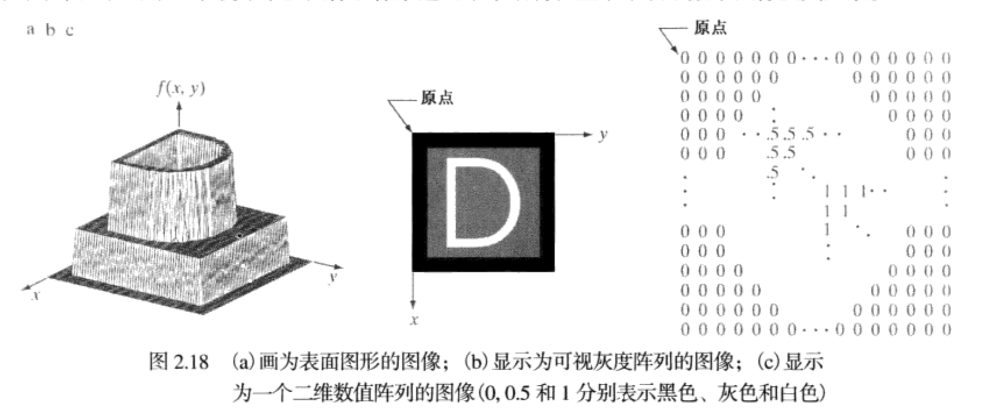

- 我们定义一幅图像中最高和最低灰度级间的灰度差为对比度。当一幅图像中像素可感知的数值有高的动态范围时，那么我们认为该图像具有高的对比度。

- 饱和度是指超过这个值的灰度级将被剪切掉这样的一个最高值(整个饱和区域具有恒定的高灰度级)，这种情况下噪声表现为粒状纹理模式。噪声，特别是较暗图像区域中的噪声，掩盖了可检测的最低真实灰度级。

- 存储数字图像所需的比特数b为
  - $$b=M×N×k$$
  
- 当M==N时，该式变为
  - $$b=N^2k$$
  
- 表2.1中显示了N和K取不同值时需要用来存储方形图像的比特数，括号中的数字表示对应于每个k值的灰度级数。当一幅图像有($2^k$)个灰度级时，实际上通常称该图像为一幅”k比特图像“。
  
  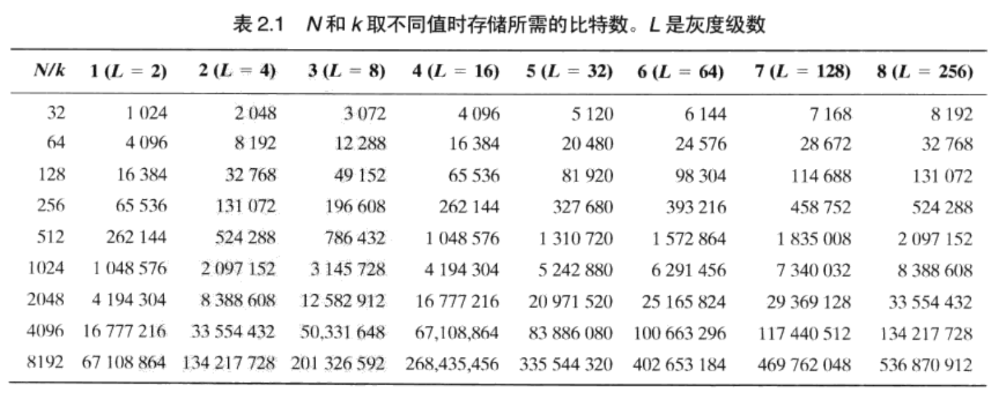
#### 2.4.3 空间和灰度分辨率
- 直观上看，空间分辨率是图像中可辩别的最小细节的度量，在数量上，空间分辨率可以有很多方法来说明，其中每单位距离线对数和每单位距离点数(像素数)是最通用的度量。假设我们用交替的黑色和白色垂直线来构造一幅图形，其中线宽为W个单位(W可以小于1),线对的宽度就是2W，每个单位距离有1/2W个线对。例如一条线的宽度是0.1mm，那么每1mm就有5个线对。广泛使用的图像分辨率的定义是每单位距离可分辨的最大线对数量。

- 类似的，灰度分辨率是指在灰度级中可分辨的最小变化。

- 降低图像空间分辨率的效果说明
  - 图2.20显示了降低一幅图像的空间分辨率的效果。图2.20(a)到(d)显示了分辨率分别为1250 dpi,300 dpi,150 dpi和72 dpi的图像。很自然，低分辨率的图像与原图像相比要小。例如，原图像的大小为3692×2812像素，但72 dpi图像是一个大小为213×162的阵列。为便于比较，所有的小图像都放大到了原图像的大小。
  
  - 图2.20(a)和图2.20(b)之间有一些较小的视觉差别，最明显的差别是大的黑针稍微有点失真。然而，图2.20(b)的大部分还是可以接受的。事实上，300 dpi是书籍印刷所用的最小空间分辨率。因此，这里我们不能期望看到很大的不同。图2.20(c)显示了可见的退化(例如，计时器的圆形边缘和右侧指向60处的小针)。图2.20(d)显示了图像中多数可见特征的退化。
    
    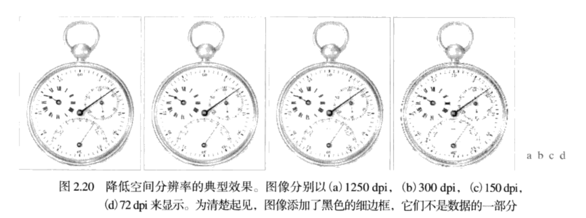
  
- 改变数字图像中灰度级数的典型效果
  - 在这个例子中，我们保持样本数恒定，而将灰度级数以2的整数次幂从256减少到2。图2.21(a)是一幅大小为452×374的CT投影图像，它以k=8(256个灰度级)显示。这样的图像是通过将X射线源固定在一个位置，然后在任何期望的方向生成二维图像来得到的。投影图像用于指导设置CT扫描仪的参数，包括倾斜角、切片数和范围。
  
  - 图2.21(b)到图2.21(h)是在保持图像大小为452×374像素不变的情况下，比特数从k=7减小到k=1 时得到的图像。256级、128级和64级灰度图像对于所有实用目的在视觉上的效果是相同的。然而，图2.21(d)所示的32灰度级图像中，在恒定或接近恒度灰度区域(尤其在头盖骨处)内有一组不易察觉的细小山脊状结构。这种效果是由数字图像的平滑区域中的灰度级数不足引起的，通常称为伪轮廓，之所以这样称呼，是因为这些山脊状结构类似于地图中的地形轮廓。伪轮廓通常在以16或更少级数的均匀设置的灰度级显示的图像中十分明显，如图2.21(e)到图2.21(h)所示的图像。
  
    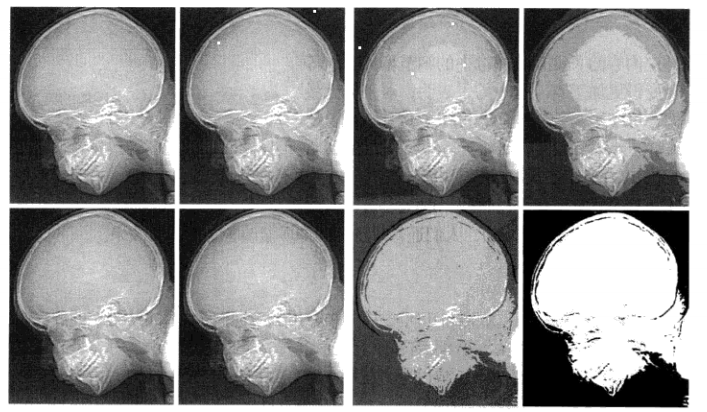
#### 2.4.4 图像内插
- 内插是在诸如方法，收缩，旋转和几何矫正等任务中广泛应用的基本工具。从根本上看，内插是用已知数据来估计未知位置的数值的处理。我们用一个简单的例子开始讨论该话题。假设一副大小为500×500像素图像要放大1.5倍到750×750像素。一种简单的放大方法是创建一个假想的750×750网格，它与原始图像具有相同的间隔，然后将其收缩，使它准确的与原图匹配。显然，收缩后的图像比原图间隔要小。为了对覆盖的每一个点赋以灰度值，我们在原图像中寻找最接近的像素，并把该像素的灰度赋给750×750网格中的新像素。这种方法称为最近邻内插法。因为这种方法就是把原图像中最近邻的灰度赋给了每个新位置。但这种方法并不实用，可能会造成边缘的严重失真等。

- 更实用的方法是双线性内插，在该方法中，我们用4个最近邻取估计给定位置的灰度。令(x,y)为我们想要赋以灰度值的位置的坐标，并令v(x,y)表示灰度值。对于双线性内插来说，赋值是由下面的公式得到的
  - $$v(x,y)=ax+by+cxy+d$$
  
- 与方法名相反，双线性内插不是一种线性内插方法，因为包含有xy项。其中四个系数可以用4个(x,y)点写出的未知方程式来确定。

- 双三次内插，它包括16个最近邻点，赋予点(x,y)的灰度值是使用下式得到的
  - $$v(x,y)=\sum^3_{i=0}\sum^3_{j=0}a_{ij}x^iy^j$$
  
- 其中16个系数可由16个用(x,y)点最近邻点写出的未知方程确定。

- 双三次内插在保留细节方面比双线性内插要好，是商业图像编辑程序的标准内插方法。

- 用于图像收缩和放大的内插方法的比较
  - 使用双线性内插得到的结果较最近邻内插有重大改进。双三次内插的结果较双线性内插的结果稍微清晰一些。
    
    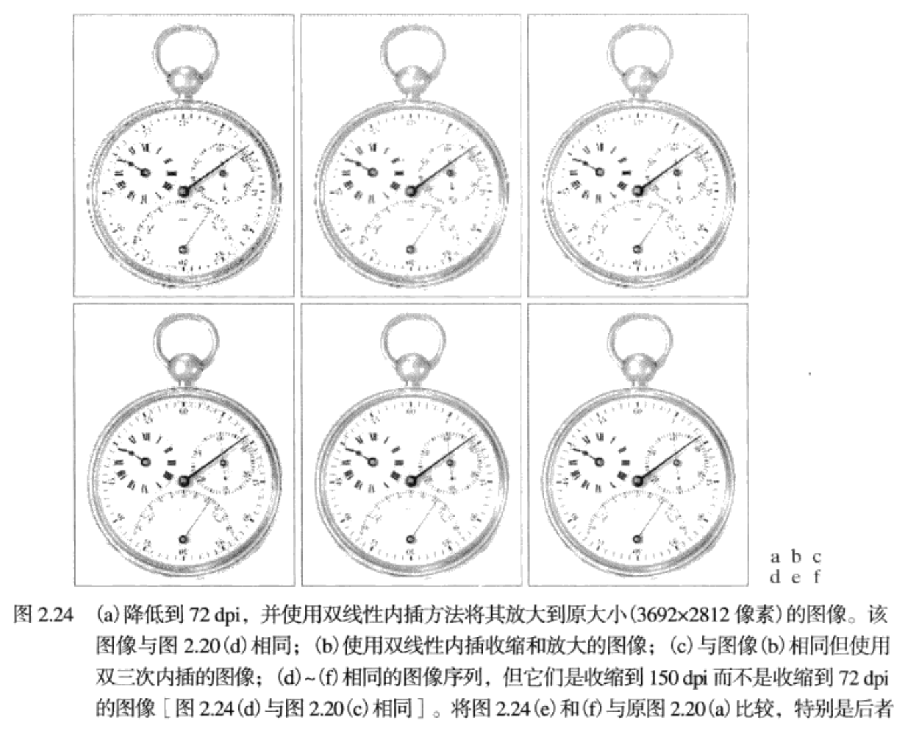
### 2.5像素之间的一些基本关系
#### 2.5.1 相邻像素
- 4邻域(N4): x的上下左右四个点位。
- 对角邻域（ND）：x的左上，左下，右上，右下四个点位。
- 像素邻域（N8）N4+ND：x的周围八个点位。
#### 2.5.2 邻接性，连通性，区域和边界
- 像素连接需要满足两个条件：一是两个像素相互接触(邻接)，二是两个像素满足某个特定的相似准则，比如像素灰度值相等或灰度值处于同一个区间V内，这个区间V是人为设置的。

- 邻接和连接不是一类，邻接就是两个像素相邻而已，连接需要满足灰度值条件和邻接条件
  - 4连接：两个像素P和R都在区间V内，且R属于N4(P)。
  
  - 8连接：两个像素P和R都在区间V内，且R属于N8(P)。
  
  - m连接：两个像素P和R都在区间V内，且R属于N4(P)或R属于ND(P)，且N4(p)与N4(r)的交集不在v中。
  
    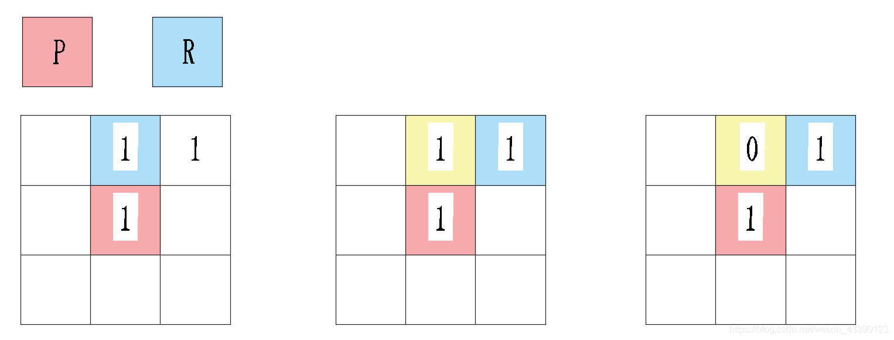
  
- 像素点P($x,y$)到像素点Q($s,t$)的一条通路由一系列独立像素点($x_n,y_n$)，像素序列($x_n,y_n$)满足统一连接规则的同时且满足灰度相似准则
  - 4-连通：序列中相邻像素均满足4-连接。
  
  - 8-连通：序列中相邻像素均满足8-连接。
  
  - 连通的路线必须是唯一的，但8连接有时候会出现多条路都能走的情况，这时候m连接就派上用场了。
    
    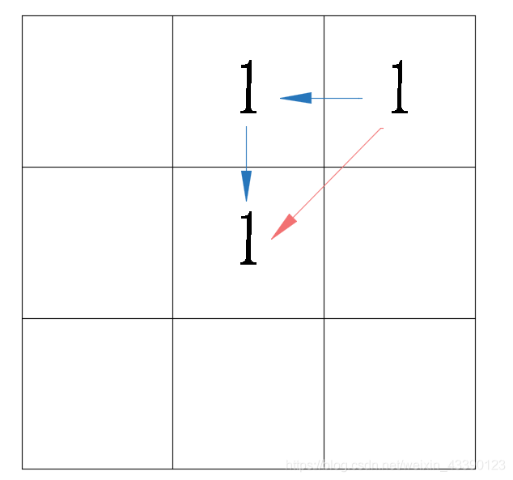
    
    - 比如这种情况，蓝色线路和红色线路都能走，此时我们规定必须要走m连接，那么就只剩下蓝色路线了。因此m连接的实质：在像素之间同时存在4-连接和8-连接时，优先采用4-连接.
#### 2.5.3 度量距离
- 对于坐标分别为(x,y),(s,t)和(v,w)的像素p,q和z，如果
  - $$D(p,q)\geq 0[D(p,q)=0,当且仅当p=q]$$
  - $$D(p,q)=D(q,p)且$$
  - $$D(p,z)\leq D(p,q)+D(q,z)$$
  
- 则D是距离函数或度量。p和q间的欧几里得(欧式)距离定义如下：
  -c$$D_e(p,q)=[(x-s)^2+(y-t)^2]^{\frac{1}{2}}$$
  
- 对于距离度量，距点(x,y)的距离小于或等于某个值r的像素是中心在(x,y)且半径为r的圆平面。p和q间的距离D4(又称为城市街区距离)由下式定义；
  - $$D_4(p,q)=|x-s+|y-t|$$
  
- 在这种情况下，距(x,y)的距离D4小于或等于某个值r的像素形成一个中心在(x,y)的菱形。例如，距中心点(x,y)的距离D4小于或等于2的像素，形成固定距离的下列轮廓
  
  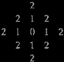
  
- 其中D4=1的像素是(x,y)的4邻域。p和q间的D8距离(又称为棋盘距离)由下式定义：
  - $$D_8(p,q)=max(|x-s|,|y-t|)$$
  
- 在这种情况下，距(x,y)的Dg距离小于或等于某个值r的像素形成中心在(x,y)的方形。例如，距中心点(x,y)的Dg距离小于或等于2的像素形成下列固定距离的轮廓：
  
  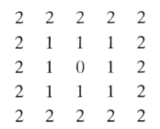
  
- 其中Dg=1的像素是(x,y)的8邻域。注意，p和q之间的D!距离和D,距离与任何通路无关，通路可能存在于各点之间，因为这些距离仅与该点的坐标有关。然而，如果选择考虑m邻接，则两点间的Dm距离用点间的最短通路定义。在这种情况下，两个像素间的距离将依赖于沿通路的像素值及其邻点值。例如，考虑如下排列的像素并假设p,P2和p4的值为1,p1和p3的值为0或1:
  
- 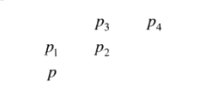
  
- 假设我们考虑值为1的像素邻接[即V={1}]。如果pj和p3是0,则p和p4间的最短m通路的长度(D距离)是2。如果p是1,则p2和p将不再是m邻接的(见m邻接的定义),并且最短m通路的长度变为3(通路通过点ppiP2p?)。类似地评论，如果p3是1(且pi是0),在这种情况下，此时最短的m通路距离也是3。最后，如果pi和p3都为1,则p和p?间的最短m通路的长度为4,在这种情况下，通路通过点pPIP2P3P4。
### 2.6 数字图像处理中所用数学工具的介绍
#### 2.6.1 阵列与矩阵操作
- 阵列与矩阵操作间的区别，例如考虑下面的2×2图像:  
$$\left[ \begin{array}{c} a_{11} & a_{12} \\ a_{21} & a_{22} \end{array} \right]和\left[ \begin{array}{c} b_{11} & b_{12} \\ b_{21} & b_{22} \end{array} \right]$$
- 这两幅图像的阵列相乘是：

